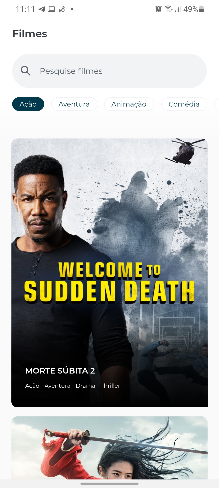

# The Movie Challenge

Aplicativo proposto pela empresa Cubos Tecnologia como teste técnico, com o objetivo de construir uma aplicação mobile que liste filmes e suas respectivas informações vindas de uma API.


## Telas do aplicativo

<div align="center">
	<span style="padding-left:2px"></span>
    <span style="padding-left:2px"></span>
    
</div>


## Escopo

- Consumir os dados da API The Movie DB (https://developers.themoviedb.org/3/getting-started/introduction);

- Desenvolver a aplicação em Flutter;

- Utilizar o padrão de arquitetura que preferir (MVP, MVP, MVVM, Bloc, MobX, etc).


## Tecnologias Utilizadas

- Flutter;
- MobX: Utilizado para gerenciar o estado da aplicação;
- Flutter Modular: Arquitetura escalável, separada por módulos com injeção de dependências e rotas dinâmicas;
- Dio: Utilizado para se comunicar com a API ;
- Shimmer: Utilizado para fazer animação de Skeleton.


## Execução do código


```bash
$ git clone https://github.com/MateusHBR/TheMovieChallenge.git

# Acesse a pasta do projeto

$ cd TheMovieChallenge-main

# Tenha o ambiente Flutter instalado, configurado em sua máquina e com a variável de ambiente corretamente configurada.


# Caso queira rodar no seu computador, tenha um emulador de Android ou IOS configurado em sua máquina e em execução para poder executar o Aplicativo.
# O comando abaixo é caso você esteja utilizando um emulador em sua máquina
$ flutter run 

# O comando abaixo é caso você queira utilizar em seu dispositivo, ele irá gerar um apk que poderá ser instalado em seu dispositivo, caso use Android.
$ flutter build apk

# Caso queria utilizar o aplicativo em seu dispositivo móvel, acesse a pasta ./build/app/outputs/apk/release/app-release.apk
# Pegue este arquivo app-release.apk e instale em seu dispositivo.
```


